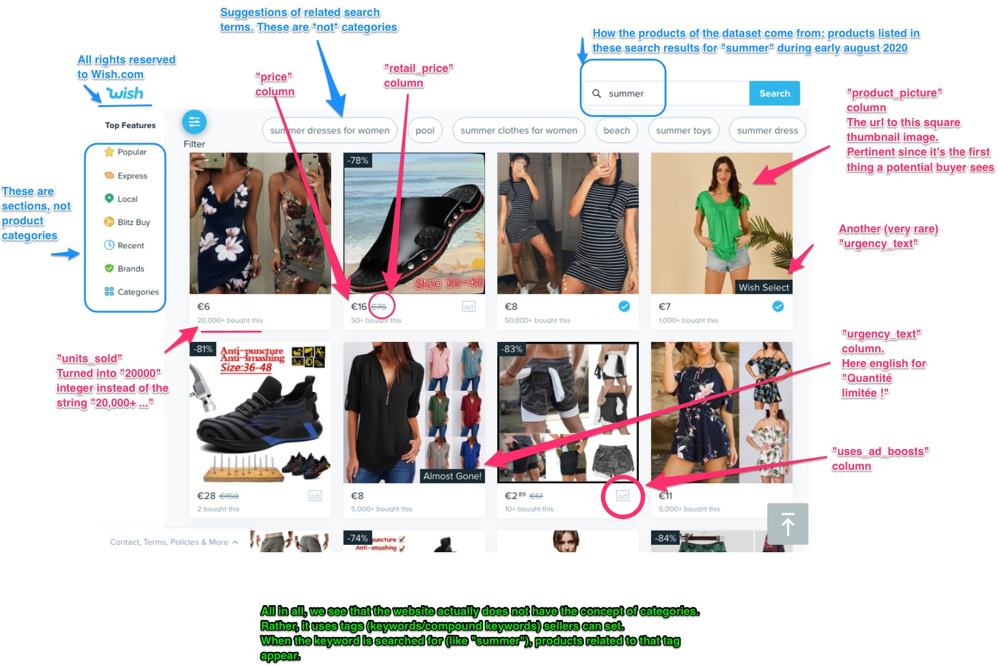

# Summer Sales Dataset: Factors Affecting Merchang Income

The goal of this project is to complete an end-to-end data science project on the [Sales of summer clothes in E-commerce Wish dataset](https://www.kaggle.com/jmmvutu/summer-products-and-sales-in-ecommerce-wish).

## Summary

The [Sales of summer clothes in E-commerce Wish dataset](https://www.kaggle.com/jmmvutu/summer-products-and-sales-in-ecommerce-wish) is a real world e-commerce dataset consisting of product listing from [Wish](https://www.wish.com/search/platform), with features such as price, retail price, ratings count, product sizes and colors, and units sold. This project will provide an end-to-end analysis on this heterogeneous dataset, including data cleaning and exploratory data analysis.

## Approach

The following is the breakdown of the work flow of this project

**Data Cleaning**
* Removal onf uninformative features
* Dealing with null values
* Cleaning up of relevant features

**Exploratory Data Analysis (EDA)**
* Observing the distributions
* Effets of using ad boosts
* Rating counts and their densities
* Price reduction, sizes, and colors

**Dimensionality Reduction**
* Dimensionality reduction using Generalized Low Rank Model (GLRM)

**Clustering**
* K Means
* DBSCAN
* HDBSCAN

## Results 

After completing the project, the following were observed from the analysis:

* Ad boosting has no significant impact on the revenue generated from a product
* Ratings count (for all ratings one to five) has a significant linear correlation with revenue generated from a product
* No significant linear relationship was found between merchant rating and product revenue
* Displayed price reduction between retail price and actual price has no significant impact on the revenue generated from a product
* Product colors containing darker shades tends to have highest revenue generated 

## References

1. [PCA on a Data Frame (Paper on GLRM Application](https://pdfs.semanticscholar.org/876c/d09e5261733b29e54a3580927eb15e9c6d39.pdf)
2. [A Hybrid Approach To Hierarchical Density-based Cluster Selection (HDBSCAN Paper)](https://arxiv.org/abs/1911.02282)
3. [Sales of summer clothes in E-commerce Wish dataset](https://www.kaggle.com/jmmvutu/summer-products-and-sales-in-ecommerce-wish)
